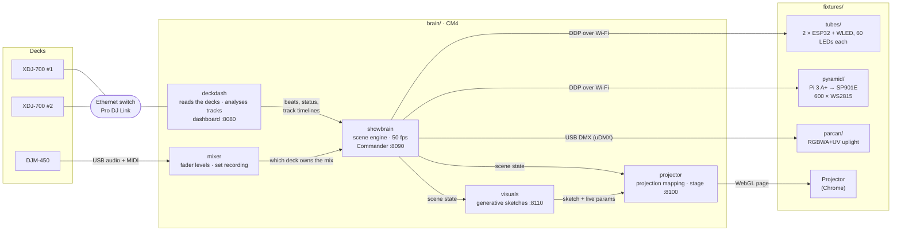

<picture><source media="(prefers-color-scheme: dark)" srcset="docs/brand/sektor5-stencil-white.svg"></picture>

A light and visuals rig driven by the DJ decks. A Raspberry Pi Compute Module 4 (the **brain**) joins the Pioneer DJ Link network and listens to the mixer over USB. It reads what each deck is playing, analyses every loaded track ahead of time to find breakdowns, builds and drops, and drives the lights and projection from one scene engine.

**Status (27 Sep 2026):** running end to end in the workshop.
- Two XDJ-700s and a DJM-450 drive two LED tubes, a DMX par can and a mapped projector.
- The live deck follows the mixer faders.
- Generative visuals have 18 sketches with presets.
- Anyone can watch the dashboard from a public link; changes need an admin PIN.
- An LED pyramid is wired and taking test patterns, but isn't in the show yet.

## System

## How it works

1. **Reading the decks.** `deckdash` joins Pro DJ Link as a virtual player (it shows up on the decks as *Sektor5*) using [beat-link](https://github.com/Deep-Symmetry/beat-link). It receives beats and each deck's status, and pulls metadata, artwork, beat grids and colour waveforms from the rekordbox USB.
2. **Reading ahead.** When a track loads, `deckdash` measures bass and energy for every bar and labels the track: intro, groove, breakdown, build, drop, outro.
3. **Following the mix.** `mixer` reads the DJM-450's post-fader levels over USB. The deck holding most of the mix drives the lights, with deck-state rules as a fallback. It also reacts to bass kills, filter and FX, and records every set to FLAC. See [docs/show-engine.md](docs/show-engine.md#which-deck-drives-the-lights).
4. **Scenes.** `showbrain` steps through GROOVE → BREAKDOWN → BUILD → PRE-DROP → DROP, timed in beats, so tempo changes and loops are handled. Each fixture renders its own look for the scene. LED fixtures get frames over DDP on UDP 4048, and the par can gets DMX over USB. Per-fixture delays make everything hit the drop together.
5. **Projection.** `projector` maps content onto surfaces with per-pixel homography in WebGL. One content source is the live sketch from `visuals`, which reacts to the beat, the scene and the playing track's waveform.
6. **Tempo.** The brain can be the DJ Link tempo master: BPM reset, tempo ramps, and an automix that lines up the kicks so drops land together. See [docs/show-engine.md](docs/show-engine.md#tempo-master-bpm-reset-and-automix-tempo-ramps).

## Pages

All pages are served by the brain (`sektor5.local` on the rig's network). Changing anything needs the admin PIN; viewers can look but not touch ([details](docs/brain.md#admin-pin-viewers-and-admins)).

| Page | Where | What it does |
|---|---|---|
| **Decks** (dashboard) | `:8080` | Live decks in XDJ-style waveform lanes with predicted sections and drops, plus a Serato-style track library. Click the logo for the **System** view: temperature, CPU, memory, services, clients, hardware and Tailscale. |
| **Lighting** (Commander) | `:8090` | Performance pads (strobe, blinder, blackout, flash), latched scenes, colour lock, per-fixture mute and level, tap clock, drop control. |
| **Projection** | `:8100/edit` | Mapping editor: surfaces, masks, content, presets. The projector itself opens `:8100/`. |
| **Visuals** | `:8110` | Choose and reshape the live generative sketch and its presets. `:8110/rd.html` is a GPU test lab. |
| **Stage** | `:8100/stage.html` | 3D view of the whole rig lit live from the show, with laser shows, projector brightness and a stage designer. |

| | |
|---|---|
|  **Decks** |  **Lighting** |
|  **Visuals** |  **Projection** |
|  **Stage** | |

**Remote:** the brain is on Tailscale. The dashboard has a public, view-only link; the other pages are available to the team over the tailnet. See [docs/brain.md](docs/brain.md#remote-access-tailscale).

## Repository layout

| Folder | What's in it | Docs |
|---|---|---|
| [`brain/deckdash/`](brain/deckdash/) | Java Pro DJ Link client, track analyser, dashboard, system info, auth | [show-engine.md](docs/show-engine.md), [api.md](docs/api.md) |
| [`brain/showbrain/`](brain/showbrain/) | Python scene engine, looks, fixture outputs, Commander, `config.json` | [show-engine.md](docs/show-engine.md) |
| [`brain/mixer/`](brain/mixer/) | DJM-450 USB bridge: levels, MIDI, set recording | [show-engine.md](docs/show-engine.md#mixer-reactions-and-set-recording) |
| [`brain/projector/`](brain/projector/) | Projection mapping and the Stage visualiser | [projector.md](docs/fixtures/projector.md), [stage.md](docs/stage.md) |
| [`brain/visuals/`](brain/visuals/) | Generative sketches (GLSL + presets) and their control page | [visuals.md](docs/visuals.md) |
| [`brain/common/`](brain/common/) | Shared by every service: the admin PIN (`s5auth.py`, and `web/s5auth.js` for the pages) | [brain.md](docs/brain.md#admin-pin-viewers-and-admins) |
| [`brain/system/`](brain/system/), [`brain/provision/`](brain/provision/) | systemd units and config; cloud-init for flashing the CM4 | [brain.md](docs/brain.md#build-it-from-scratch) |
| [`brain/tools/`](brain/tools/) | `set_pin.py`, a receive-only DJ Link decoder | |
| [`brain/deploy.sh`](brain/deploy.sh) | Push code to the rig and restart services | |
| [`fixtures/`](fixtures/) | Tubes, pyramid, par can, and the retired HUB75 panels | [docs/fixtures/](docs/fixtures/) |
| [`docs/`](docs/) | Everything else, including [brand/](docs/brand/), [design.md](docs/design.md), `history/` and `manuals/` | |

## Hardware

| Part | Role |
|---|---|
| 2 × Pioneer XDJ-700 (fw 1.13) | Decks, linked through an unmanaged Ethernet switch |
| Pioneer DJM-450 | Mixer, USB to the brain for fader levels and recording |
| Raspberry Pi CM4 (4 GB, 32 GB eMMC, Wi-Fi), carrier board, fan | The brain. Ethernet to the decks, Wi-Fi to the fixtures |
| 2 × 103 cm RGB floor tubes, each with an ESP32 running WLED | LED tubes |
| Battery RGBWA+UV uplight, anyma uDMX | Par can, 10-channel DMX at address 1 |
| Projector with Chrome | Projection mapping and generative visuals |
| Raspberry Pi 3 A+, SP901E amplifier, 2 × 5 m WS2815 (12 V) | LED pyramid (not in the show yet) |
| ESP32-C3-Zero + WLED, 74AHCT125, 2 × 3-LED SK9822 boards, USB power bank | The DJ's mask eyes ([docs](docs/fixtures/mask.md)) |

## Working on it

- **Team:** Richard owns the front end (dashboard, Stage), Chris owns projection mapping and visuals. The brain and fixtures expose everything they need through the [API](docs/api.md).
- **Changes** go through a PR to `main`; collaborators merge their own. `main` is what's running. See [CONTRIBUTING.md](CONTRIBUTING.md).
- **Deploy:** `brain/deploy.sh live <target>` deploys `origin/main`, one target at a time: `deckdash`, `web`, `preview`, `showbrain`, `mixer`, `projector`, `visuals`, `tools`, `pyramid`, `panel`. With no target it deploys every brain service.
- **Try page changes** at `:8080/preview/` against live data before going live.
- **Add a fixture:** list it in [`brain/showbrain/config.json`](brain/showbrain/config.json) (`strip`, `panel`, `pyramid`, `eyes` or `dmx_par`) and deploy `showbrain`.
- **Secrets and site settings** (Wi-Fi, host overrides) live in a git-ignored `.env`; copy [`.env.example`](.env.example). Settings are `S5_*` (old `RAVE_*` names still work). Never commit SSIDs, passwords or addresses.

## Rebuilding the rig

1. **Brain:** flash and set up the CM4 → [docs/brain.md](docs/brain.md).
2. **Decks:** both players and the brain's Ethernet on one switch; a rekordbox-exported USB in a player. DJM-450 USB to the brain.
3. **Tubes:** ESP32 + WLED in each tube → [docs/fixtures/tubes.md](docs/fixtures/tubes.md).
4. **Par can:** uDMX into the brain, light on 10-channel DMX at address 1 → [docs/fixtures/parcan.md](docs/fixtures/parcan.md).
5. **Pyramid:** Pi 3 A+ → SP901E → strips → [docs/fixtures/pyramid.md](docs/fixtures/pyramid.md).
   **Leg pyramids** (the two side ones, not built yet): ESP32 + WLED, a strip per leg, a laser at the apex → [docs/fixtures/leg-pyramids.md](docs/fixtures/leg-pyramids.md).
6. List the fixtures in `config.json`, run `brain/deploy.sh`, then set the admin PIN (`ssh -t pi@sektor5.local 'python3 ~/tools/set_pin.py'`).

## Known limitations

- **Track analysis and drop detection aren't done.** The live decks use a waveform-only analyser checked by eye on a handful of tracks; it doesn't read rekordbox's phrase analysis yet, and it has known failure modes (a drop called inside a build). Commander marks fix individual tracks. The plan, with a labelled test set from the DJ's library, is in [docs/track-analysis.md](docs/track-analysis.md).
- **The pyramid's Wi-Fi** has dropped several times.
- **The Pi has no RTC**, so its clock is wrong until time syncs after boot.

## Next

Pyramid pixel map and looks, drop-prediction calibration, and laser and smoke outputs. Smoke will have hardware-enforced off-by-default, burst limits and arming. The brain is `sektor5` (the old `ravecave.local` still answers for now). The fixtures' hostnames, service account and `/srv/rave` paths still use the old Rave Cave name and move to `s5-box` / `s5-tube-N` in a later rename; logos and colours are in [docs/brand/](docs/brand/).
- **Running the show from a Mac:** `./run.sh` launches it against the real rig (decks, pyramids, tubes, par can); `./run.sh stop` stops it. See [docs/sim.md](docs/sim.md#on-a-mac-with-the-real-rig).
- **No hardware?** `brain/sim/run.sh` runs the whole app on your computer against a synthetic rig: decks, mixer and an auto-mixed set. See [docs/sim.md](docs/sim.md).
