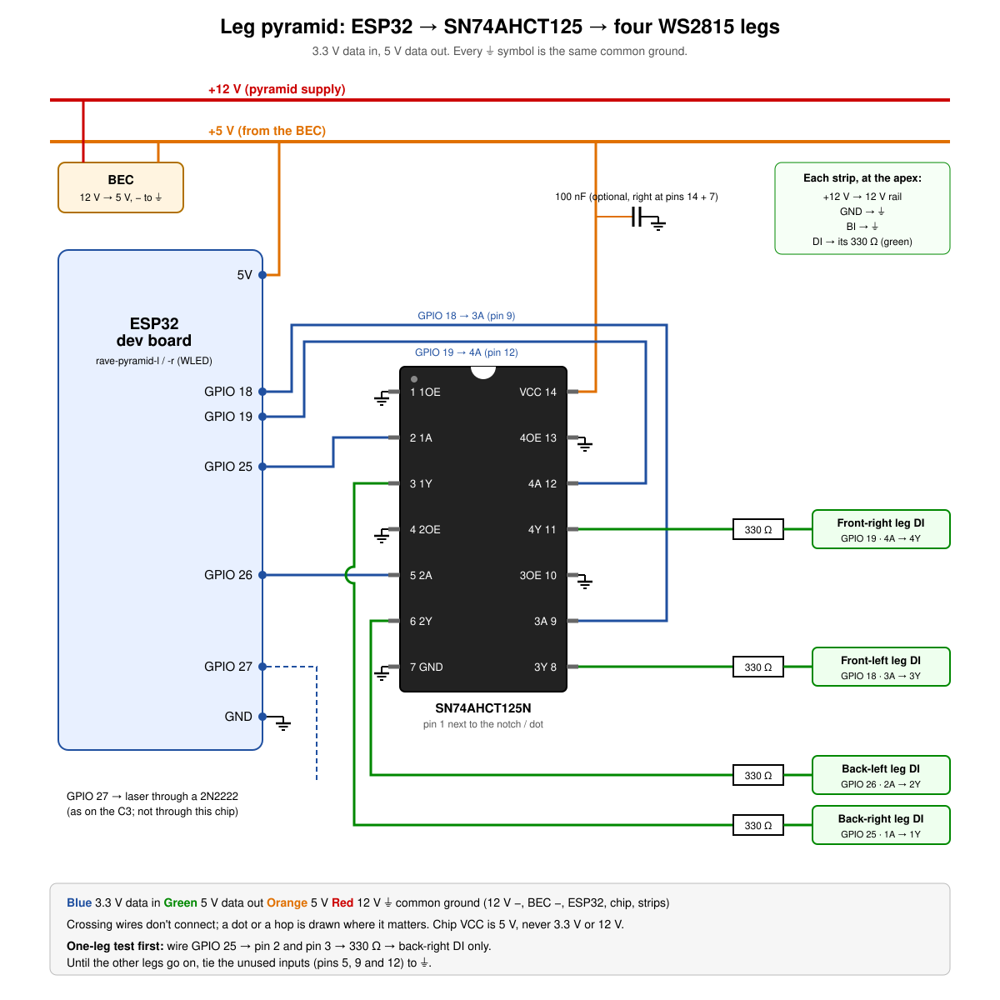

# Leg pyramids

Two small pyramids, one either side of the stage. Each is four aluminium legs slotted into a 3D-printed top junction. A WS2815 strip runs up the outside of each leg, an ESP32 at the top drives each leg from its own pin, and a red laser points straight up out of the apex. A white fabric cover over the frame is optional.

**Status (7 Oct 2026):** being built. Pyramid R's controller is wired through a 74AHCT125 and drives its legs cleanly (below). Pyramid L ran mirrored from the Pi on 3 Oct. Showbrain already drives them (`pyramidL`, `pyramidR` in [`config.json`](../../brain/showbrain/config.json), kind `pyramid`), and the Stage view shows what it sends, so the show can be worked out before the hardware exists. Until the controllers are on the network the output goes nowhere.

These are a different fixture from the big [LED pyramid](pyramid.md) (600 LEDs on the Pi `rave-box`).

## Frame

From the Fusion model **Pyramid v3** (project *Random*, folder *Rave Cave*):

| Part | Size |
|---|---|
| Legs | 4 × aluminium U-channel, 20 × 11.5 mm, 2 mm walls, 1000 mm long |
| Leg angle | 45° to the floor, one leg to each corner |
| Footprint | feet about 1.02 m apart (square), about 1.44 m corner to corner |
| Height | apex about 0.74 m |
| Top junction | 3D printed, about 83 mm across and 43 mm tall, four leg sockets |
| Laser boss | on top of the junction, 14.6 mm across with a 14.2 mm bore |

The legs just slot in, so a pyramid packs flat: four legs and a junction.

## Electronics (per pyramid)

| Part | Notes |
|---|---|
| 4 × WS2815, 12 V, IP65/67, **56 LEDs each** | One per leg, cut from a reel (cut only on the marks, and keep the arrows pointing away from the apex end), in the channel on the outside face. Four wires each: +12V, GND, DI, BI. |
| ESP32 dev board (ESP-32S NodeMCU, 38-pin, CP2102: the tubes' old boards) | In or on the junction. Runs WLED. Pyramid L's is the board that was Rave Tube 1's. |
| SN74AHCT125N (14-pin DIP), one per pyramid | Lifts the ESP32's 3.3 V data to 5 V, one channel per leg. Needed: 3.3 V straight from the ESP32 glitched (see below). |
| Red laser module | In the boss, pointing up. Switched from GPIO 27 through a 2N2222 on its ground side (WLED's On/Off output; a PWM output didn't switch the 2N2222 on the stand-alone laser). |
| 12 V 10 A supply, one per pyramid | 4 × 56 LEDs is about 3.4 A at full white at 15 mA per LED (the figure in [pyramid.md](pyramid.md)). An inline 5 A fuse is worth adding. WLED's current limiter is off (it assumes 5 V strips). |
| 12 V → 5 V BEC (≥ 1 A) | Powers the ESP32 through its **5V** pin. Never USB and the BEC at the same time. |

### Wiring

| From | To |
|---|---|
| ESP32 GPIO 18 → chip pin 9 (3A); pin 8 (3Y) → 330 Ω | front-left leg DI |
| ESP32 GPIO 19 → chip pin 12 (4A); pin 11 (4Y) → 330 Ω | front-right leg DI |
| ESP32 GPIO 25 → chip pin 2 (1A); pin 3 (1Y) → 330 Ω | back-right leg DI |
| ESP32 GPIO 26 → chip pin 5 (2A); pin 6 (2Y) → 330 Ω | back-left leg DI |
| chip pin 14 (VCC) | the BEC's 5 V (not 3.3 V, not 12 V) |
| chip pins 1, 4, 10, 13 (the OE pins) and 7 (GND) | GND |
| ESP32 GPIO 27 → 1 kΩ → 2N2222 base (10 kΩ base to GND) | laser: its − to the collector, emitter to GND |
| each strip's BI (first LED) | GND |
| 12 V | each strip's +12V and GND at the top, the BEC, the laser (if 12 V) |

GPIO 25 and 26 sit side by side on one header (next to 27, the laser), 18 and 19 side by side on the other, which keeps the leads tidy; which chip channel a leg uses doesn't matter to WLED, only the GPIO.

- The pins avoid the ESP32's boot pins (0, 2, 5, 12, 15), its flash (6–11) and the input-only ones (34–39); see [tubes.md](tubes.md#2-wiring-the-esp32). Not GPIO 14, 15 or 32 either: the WLED build's AudioReactive usermod holds them (its mic pins) even when it's off.
- A 330 Ω resistor in series at each chip output (220–470 Ω is fine). Not needed to make it work over these short leads, but it protects the first LED and the chip if the data line is live while a strip's 12 V isn't connected: plug strips in with the power off.
- The OE pins are *output enable*, active low: low, the channel passes data; high or floating, its output goes open circuit. Tie them to GND, never leave them floating. Unused inputs must be tied to GND or VCC too (the datasheet's note); tying a spare channel's A and OE to VCC switches it off cleanly. A 100 nF capacitor across pins 14 and 7 is good practice.
- One common ground for everything: the 12 V supply, the BEC, the ESP32, the chip and every strip.

### Data level: 3.3 V or shifted

WS2815 data is meant to be 5 V logic; the ESP32 gives 3.3 V. With the ESP32 at the apex the data leads are a few centimetres, and 3.3 V often works, but it's on the margin, so test it hard before trusting it:

1. One strip, data straight from GPIO 13 (with the 330 Ω). Full white, then a fast rainbow, then the show streaming (a spiral build). Watch for flicker or wrong colours, mostly on the first LEDs.
2. If it glitches: a BSS138 converter channel in line (LV = the ESP32's 3V3, HV = the BEC's 5 V, grounds common). These are made for I2C: the 5 V side is pulled up through a resistor, so its rising edge is slow for WS281x data (a "0" bit is high for only about 0.35 µs). They often work over short leads anyway.
3. If that's flaky too: a 74AHCT125. **This is the answer** (7 Oct 2026, below). Its inputs are TTL-level (high is anything above 2 V), so 3.3 V drives it fully, and its outputs swing a clean, fast 0–5 V.

What we found (3 Oct 2026, one 56-LED leg strip, 12 V):

- **These strips are RGB order**, not GRB (red and green come out swapped on GRB). Set RGB in WLED's output settings, or `--order RGB` on a Pi receiver.
- **BI must be tied low.** Left floating, or fed from the SP901E's unused DAT 2 output, the strip shows drifting colours and white bands. Grounding DAT 2's input on the SP901E also works, since its output then holds BI low.
- **ESP32 + WLED: not clean yet.** Direct 3.3 V from GPIO 13 or 22 gave drifting colours. Through the SP901E (with BI held low) it was mostly right but still threw white flashes and bands. Not yet tried: a 330 Ω series resistor at the SP901E output, and a ground wire run alongside the data.
- **ESP32 + 74AHCT125: clean** (7 Oct 2026, Pyramid R's board, RGB order, no 330 Ω yet). Solid colours, blackouts and a run of WLED effects (rainbow, chase, theater, twinkles, strobe) with no flicker, stray pixels or bands.
- **Pi + SP901E: clean.** `rave-box` (Pi 3 A+, the [LED pyramid](pyramid.md)'s receiver: GPIO 10 SPI → SP901E DAT 1) drove the same strip steadily through red, green, blue and white with clean blackouts between. Its `pyramid` service now runs with `--order RGB` (changed on the Pi; [`setup_rave_box.sh`](../../fixtures/pyramid/setup_rave_box.sh) still installs GRB).

So the strip, its power and the SP901E were fine; the problem was the ESP32's 3.3 V data, which the 74AHCT125 fixes. Before the chips arrived, one pyramid can run **mirrored** from `rave-box`: the Pi's one data line into the SP901E, its four outputs to the four legs' DI (BI to GND), so all four legs show the same thing. In showbrain's `config.json` that's `"wiring": "mirrored"` on the pyramid (looks for four identical legs: the spiral becomes a straight fill, comets run up every leg at once; it sends one leg, no laser), with `"from_apex": true` if the strips are fed from the top, and the host set to the Pi. **This is how Pyramid L ran on 3 Oct 2026**: all four legs on DAT 1 outputs, mirrored, fed from the apex, driven from a showbrain with `pyramidL` set to `"host": "192.168.20.36", "wiring": "mirrored", "from_apex": true` (a local config change; main's `config.json` stays the ESP32 build).

Tried and not working yet, **diagonals**: the SP901E's two inputs fed from two Pi pins, DAT 1 from pin 19 (GPIO 10, the `pyramid` service, UDP 4048) and DAT 2 from pin 12 (GPIO 18, PWM: the `pyramid2` service, UDP 4049, running as root), so two diagonal pairs show different things (`"wiring": "diagonals"`, `"ports"`). GPIO 18 was in PWM mode and `pyramid2` ran without errors, but the DAT 2 outputs never lit, even with frames sent straight to it; unresolved (the wire may never have reached pin 12: pin-numbering charts in WiringPi numbers call pin 19 "GPIO 12" and pin 21 "GPIO 13", which is SPI MISO, an input). `pyramid2` is still installed and harmless. Never feed DAT 2 from pin 23 (GPIO 11): that's the SPI clock. A Pi has one data line, so on the Pi the four legs would be chained into one run (down leg 1 from the apex, along the base and up leg 2, across the apex and down leg 3, along the base and up leg 4), with showbrain flipping legs 2 and 4.
- The strips are fed **from the top**, where the ESP32 is, so each strip's first LED is at the apex. WLED reverses each output (below) so that pixel 0 is at the foot, which is what the show and the Stage view expect.

## WLED setup

Flash and join Wi-Fi as for the tubes ([tubes.md](tubes.md#3-flashing-wled-from-a-mac); the tubes' old boards already run WLED 16.0.1 for ESP32), then in **Config → LED Preferences** set five outputs:

| Output | Type | GPIO | Length | Start | Reversed |
|---|---|---|---|---|---|
| 1 | WS281x, **RGB** order (all four) | 18 | 56 | 0 | yes |
| 2 | WS281x | 19 | 56 | 56 | yes |
| 3 | WS281x | 25 | 56 | 112 | yes |
| 4 | WS281x | 26 | 56 | 168 | yes |
| 5 | On/Off | 27 | 1 | 224 | – |

- Current limiter off (the strips have their own 12 V supply).
- Names: `rave-pyramid-l` / `rave-pyramid-r` (mDNS), as for the tubes.
- Preset 1, **Wiring check**, loads at boot: the legs red (front-left), green (front-right), blue (back-right) and white (back-left), the laser off. It shows which data line went to which leg.
- WLED sync (UDP send and receive) off: a board with a laser must never follow other WLED devices.
- Gotchas on this WLED build: output changes saved through `/json/cfg` only take effect after a real restart. On Pyramid L's board neither `{"rb":true}` nor `/reset` restarted it (its uptime kept counting); on Pyramid R's, `{"rb":true}` did. Check the uptime. Power-cycle it, or press EN, or use **Reboot** in WLED's settings. A pin WLED can't use is quietly swapped for another (asking for 14 gave 22), so read the outputs back after a restart.

The brain then drives it like a tube, as one 225-pixel strip over DDP.

## Pixel map

The same for the Stage view (`source` set to the fixture's name) and for showbrain:

| Pixels | What |
|---|---|
| 0–55 | front-left leg, foot to apex |
| 56–111 | front-right leg |
| 112–167 | back-right leg |
| 168–223 | back-left leg |
| 224 | the laser: on when its brightest channel is above half, off otherwise |

"Front" faces the audience. With another density, each leg is *n* pixels and the laser is pixel 4*n*.

## Looks

Showbrain's looks (`looks.pyramid` in [`looks.py`](../../brain/showbrain/looks.py)). The Stage view shows them live whenever a deck is playing (or the simulation is on); with nothing playing, it runs a sketch of the same looks itself, and **View → Section** previews each one on a 128 BPM clock. The two pyramids mirror each other, so a spiral turns towards the DJ on both.

| Section | Legs | Laser |
|---|---|---|
| Groove | The feet pulse with the kick in the show colour, plus (changing with the track and every 16 bars) an **orbit**: a white comet up one leg per beat, round the pyramid, or a **spiral chase**: a comet climbing the spiral once a bar | off |
| Build / hold | **The spiral fill**: the legs light from the feet in a spiral round the outside (six turns, a leg at a time), reaching the apex as the build ends, led by a white head; the lit part flickers faster (on the beat, 8ths, 16ths, 32nds) as the drop nears. A hold freezes it | off |
| Predrop | Dark, except the tips of the legs | off |
| Drop | On the downbeat a white burst runs from the apex down all four legs, then full colour (alternate legs in the complementary colour) pulsing with the kick, with a white ring falling from the apex each beat; after 4 bars a white highlight also turns round the legs, a leg a beat | **comes on with the drop**: held for the first bar, then on the kick to bar 8, then on the one |
| Breakdown, intro, outro | Slow breathing in a soft complementary colour, brighter towards the top | off |
| Strobe, blinder, blackout | follow the rest of the rig | off in a blackout |

Other ideas for later:
- Pass a comet from one pyramid to the other across the stage (left pyramid's legs, then the tubes, then the right's).
- The legs as a VU meter: the level of each deck's channel from the mixer, on its own pyramid.
- With the cover on, fills read as the whole pyramid glowing; without it, the edges draw a wireframe in the air. Looks may want to know which.

## Laser safety

Keep it to a low-power module (**Class 2, under 1 mW**, or at most Class 3R) and pointing only at the sky, never across the crowd. In Australia a laser shone into the sky can dazzle pilots: outdoor laser use near aerodromes needs CASA's assessment, and handheld lasers over 1 mW are prohibited in most states. Check the site before running it outdoors.

## To do

- Build and wire one; pick the LED density.
- Set their hosts (`S5_PYRAMID_L_HOST` / `_R_HOST` in `.env`, default `rave-pyramid-l.local` / `-r.local`) on the brain that drives them.
- In the Blender file (`stage.blend`): replace `Side_Pyramid_L` / `_R` with these, so the venue export no longer needs `venue.hide` (see [stage.md](../stage.md#venues)).
