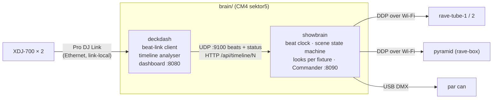

# Show engine: read-ahead lighting from the decks

How the Sektor5 CM4 (`sektor5`) turns Pro DJ Link data from the XDJ-700s into lighting that anticipates the music: it detects drops ahead of time, builds suspense into them, and hits the drop on the beat.

Code: [`brain/deckdash/`](../brain/deckdash/) (deck data, timelines, dashboard) and [`brain/showbrain/`](../brain/showbrain/) (scenes, looks, Commander).

**Status (27 Sep 2026): phases 1-4 running** on `sektor5`:
- `deckdash` (Java, :8080): deck data, the track timeline analyser (`Timeline.java`, `/api/timeline/N`), a dashboard with sections, drops and a countdown on the waveforms, a stacked scrolling two-deck waveform, and a UDP feed to showbrain (127.0.0.1:9100).
- `showbrain` (Python + numpy, :8090 Commander): the scene engine at 50 fps (about 2.5 ms per frame), driving `rave-tube-1`, `rave-tube-2` (flipped role, comet hand-off) over DDP and the par can over USB DMX. Per-track overrides and drop-calibration marks are saved in `overrides.json` on the Pi, not in git.
- Deploy with `brain/deploy.sh`.

Still to do: add the pyramid, tune latency by eye, calibrate drop detection across the library, smoke controller.

## What the decks give us

| Data | Source | Use |
|---|---|---|
| Beat packets: beat-in-bar, BPM, pitch, time to next beat/bar | Broadcast by each player on every beat | The beat clock. Every effect locks to this. |
| Player status: playing, cued, looping, master, sync, beat number | Status packets to our virtual CDJ (#7) | Which deck is live; where it is in the track; detects loops and jumps |
| Beat grid: time of every beat | USB export via CrateDigger | Converts beats to bars and phrases; lets us schedule ahead in beats, not milliseconds |
| **Detailed colour waveform**: 150 frames/s for the whole track, red = bass, green = mids, blue = highs | USB export (.EXT) | **Read-ahead**: bass and energy per bar, so we find breakdowns, builds and drops before they play |
| Hot cues and memory points | USB export | Many DJs mark drops. Treat them as strong hints. |
| rekordbox phrase analysis (Intro / Up / Down / Chorus / Outro) | USB export, **only if analysed** | Best-quality labels. Not present in this library yet (see "Improve the input"). |
| Track metadata and artwork | USB export | Per-track palette (from the artwork or the key), dashboard |

Not available: channel faders and on-air (no DJM on the link). "Live deck" is inferred instead (below).

## Evidence so far

Bar-by-bar bass and energy from the detailed waveform, with bars grouped in 8s (`|`), for the two tracks loaded on 2026-09-26:

```
Five (Original Mix) - Dennis Cruz
energy ▁▁▁▁▁▁▁▁|▆▆▆▆▆▆▆▆|...|█▇▇▇▇▇▇▇|▁▁▁▁▁▁▁▁|▁▁▁▁▁▁▁▁|▁ ▁▂▂▅▇▇|▇▇█▇▇▆█▇|...
bass          |▇▇▇▇▇▇▇▇|...|█▇▇▇▇▇▇▇|▂▂▂▂▂▂▂▁|▁▁▁▁▁▁▁▁|▁ ▁▁▂▄▇▇|▇▇█▇▇▅█▇|...
-> beat-in bar 9 (0:15); breakdown bars 81-100; build 99-104; DROP bar 105 (3:16)

It Feels So Good (Extended Mix) - Sonique, Matt Sassari, Hugel
-> beat-in bar 25 (0:45); DROP bar 57 (1:45); DROP bar 113 (3:30), each after a bass-less breakdown
```

The rule used was: a phrase boundary (every 8 bars) where the next 4 bars carry at least 1.6x the bass of the previous 8. It caught every drop in both tracks, with no false positives. It needs validating across the whole library (285 tracks on the USB).

## Architecture



- **deckdash** is the single owner of the DJ Link connection (only one process can hold the ports).
- **showbrain** is Python for fast iteration on looks. It never talks to the decks directly.
- Each fixture has its own delay (`delay_ms`) so near-instant USB DMX lands with the Wi-Fi fixtures (about 40 ms).

## Track timeline (computed when a track loads)

For each loaded track, build a list of sections in **beats**:

```json
{"track": "Five", "bars": 166, "sections": [
  {"type": "intro",     "startBar": 1,   "endBar": 8},
  {"type": "groove",    "startBar": 9,   "endBar": 80},
  {"type": "breakdown", "startBar": 81,  "endBar": 98},
  {"type": "build",     "startBar": 99,  "endBar": 104},
  {"type": "drop",      "startBar": 105, "endBar": 120, "confidence": 0.9, "source": "waveform"},
  {"type": "groove",    "startBar": 121, "endBar": 158},
  {"type": "outro",     "startBar": 159, "endBar": 166}]}
```

Detection, in priority order (**the design; today only the waveform analysis and cue hints are implemented**, see [track-analysis.md](track-analysis.md)):
1. **rekordbox phrases** if present (not read yet): `Up` means build, `Down` means breakdown, and `Chorus` after `Up`/`Down` means drop (high-mood tracks).
2. **DJ cues**: a hot cue or memory point within a bar of a waveform candidate raises confidence. A cue comment containing "drop" confirms it.
3. **Waveform analysis**: per-bar bass share and energy. A breakdown is a run of at least 4 low-bass bars. The drop is the first phrase boundary (8/16/32 bars) where bass returns strongly. The build is the rising-energy bars before the drop, or at least the last 8 bars of the breakdown.
4. **Beat-in** (first bass after the intro) is its own event type. It gets a smaller hit than a real drop.

Per-track overrides from the Commander ("mark drop here", "not a drop") are saved by rekordbox ID and title, and take precedence next time.

## Which deck drives the lights

Rules in priority order (`Engine.live_deck`, reason shown as `show.live_reason` in the API):

1. **Locked** in the Commander ("follow deck 1 / 2").
2. **Mixer** (DJM-450 over USB, via `brain/mixer`): each channel's **post-fader** level gives its share of the mix. A deck takes over when its (smoothed) share stays at or above **70% for 2 s**, i.e. the DJ has brought its fader up and the other down. During a blend neither dominates, so the lights stay put. A deck cued in headphones with its fader down has ~0% share and can't take over. Settings: `mixer` in `config.json` (`channels` maps mixer channel → player, `takeover_share`, `takeover_s`, `smoothing`, `silent_db`).
3. **Deck state** (no mixer connected): mixer on-air flags if a DJ Link mixer is present; otherwise sticky: stay on the current deck while it plays, hand over when it stops/ends, when it has been in its outro 16 s while the other has played 30 s, or when the incoming deck hits a predicted drop while the outgoing one is in its outro.

## Scene flow (state machine)

```
IDLE ──track playing──> GROOVE <──────────────┐
                          │ section=breakdown  │ 8-16 bars after drop
                          v                    │
                       BREAKDOWN               │
                          │ build window opens │
                          v                    │
                        BUILD ──(DJ loops)──> HOLD (stay at current intensity)
                          │ 1 beat before drop │
                          v                    │
                       PRE-DROP (blackout/inhale)
                          │ drop beat (minus output latency)
                          v                    │
                        DROP ──────────────────┘
```

| Scene | Looks (tube and panel) | Timing |
|---|---|---|
| IDLE | WLED's own ambient effect (Pi stops streaming) | No deck playing |
| INTRO / OUTRO | A hit on every kick over a slow colour breath; the outro at 80% | Beat-locked |
| GROOVE | Hard pulse on every beat, stronger on beat 1, a flick on the off-beat hi-hat; palette from the artwork or key; comet or chase every bar | Beat-locked |
| BREAKDOWN | Slow breathing, desaturated, around 30% brightness, sparkles on the hi-hats | Bar-locked |
| **BUILD** | Brightness climbs; strobe rate doubles every 2 bars (1/4 → 1/8 → 1/16 → 1/32); fill rises up the tube; colour drifts to white; panel chase accelerates | Intensity = progress through the build window |
| HOLD | Freeze build intensity, keep strobing at the current rate | DJ is looping the build |
| **PRE-DROP** | Near-blackout for the last beat (or half bar) | The "inhale" |
| **DROP** | Full white hit on the drop beat, then 8-16 bars of the high-energy scene (strobe on the beat, saturated palette hits); **smoke burst** if armed | Fires early by the measured output latency |

Outside drops and builds the kick's punch scales with the track's energy in that bar (`drive()` in `looks.py`: 0.8× in the quietest bars, 1.3× in the loudest).

### Interplay: the lights play off each other

Every fixture has a place across the stage, `pos` in its `role` in `config.json`, from -1 (far left, as the crowd sees it) to 1 (far right): pyramid L -1, tube L -0.5, the panel and the par can 0, tube R 0.5, pyramid R 1. Without `pos` it comes from the pyramid's `side` or the tube's place in the strip group, else the middle. A **play** says when each place gets its hit (`hit()` in `looks.py`). Every fixture works out its own kick from the beat, so they stay locked together with nothing sent between them. Left and right are always mirror images, or a call and its answer:

| Play | What it does |
|---|---|
| Together | Everything on every beat (how it used to be) |
| Alternate | Left side on 1 and 3, right side on 2 and 4, the middle on every beat |
| Call & answer (`swap`) | The left side for the first half of the bar, the right side answers in the second |
| Bounce | A ball across the stage on the 16ths: left to right in one beat, back in the next |
| Chase | A sweep across the rig on the 16ths every other beat, the other way each bar |
| Out | The middle on the beat, out to the ends by the "and" |
| In | The ends on the beat, in to the middle by the "and" |
| Zigzag | Side to side on the 16ths: left end, right end, left inner, right inner, the middle, then back out |
| Cross | The diagonals trade 8ths (left end with right inner, then right end with left inner), the middle answering on the 16ths between |
| Stack | Builds out across the bar: the middle from beat 1, the inner pair joins on 2, the ends on 3 |
| Wave | A soft hump rolling across the stage, left to right over 2 beats and back over the next 2 (not kick-locked) |
| Sparkle | Random places on the 16ths; every fixture works out the same "random" from the 16th and its place, so they agree |

The panel's columns each get their own place across its middle stretch (`span`, 0.5 by default), so a bounce or chase travels across it. The auto show picks a play by the track: every 8 bars in the groove (from all of them), from Together, Alternate, Out, Wave and Stack in the intro and outro, and every 4 bars of a drop after its first bar (Alternate, Bounce, Chase, Out, Call & answer, Zigzag, Cross, Sparkle). Builds, breakdowns and the pre-drop keep their own looks. The moving plays (Bounce, Chase, Out, In, Zigzag, Cross, Sparkle) use a shorter flash so they read as motion. The Commander's `play` command latches one (`AUTO` hands it back), and the state reports `play` (what's running) and `play_lock`.

### Layered colour, and no yellow

The lights use three colours at once rather than one and its opposite (`palette()` and `layer()` in `looks.py`). The track's hue (from its key, the visuals or a locked swatch) is joined by two more, from a scheme picked by the track and changed every 32 bars: triad, split complement, a neighbour plus the opposite, analogous, or a quarter round plus the opposite. `layer()` lays the three across the stage (left to right) and up each fixture (tube height, pyramid leg, panel row), holding each colour a while before blending into the next and drifting a step every 8 bars. Grooves, intros and outros are gradients across the rig; in drops the colour blocks, the per-bar flips and the 16th-note peak step through all three colours instead of two.

**No yellow:** every colour goes through `hsv()`, which squeezes the hues from red-orange to green so they skip amber, yellow and chartreuse (34-90°, `YELLOW`); colours outside that range are unchanged. Two colours blended in RGB can still make yellow (a red base under a green comet), so each fixture's frame also passes through `unyellow()`, which turns any clearly yellow pixel to orange or green, whichever is nearer. The Commander has no yellow swatch.

Robustness:
- **Loops**: never drop while looping. Drop when the loop exits and the playhead crosses the drop beat.
- **Pitch and tempo changes**: schedule in beats, so they're handled automatically.
- **Jumps and hot cues**: a position discontinuity re-evaluates the current section immediately.
- **DJ mixes out before the drop**: if the live deck changes or stops, cancel the build and fade to the new deck's state.
- **Paused / cued**: freeze, then fade to IDLE after about 5 s.

## Timing

- Beat packets carry *time until the next beat and bar*, so showbrain runs a beat clock (a phase-locked loop) and schedules effects ahead of time.
- **Output latency** (Wi-Fi plus WLED buffering, likely 20-60 ms) is measured once per output and subtracted, so drops land on the kick. Measure with a slow-motion phone video of the deck's beat counter next to the tube, or a tap test in the Commander.
- DDP frames at 60 fps. WLED's realtime mode falls back to its own effect if the stream stops, so the lights never freeze.

## Commander (control page on the Pi)

`http://sektor5.local:8090`, built for a phone or a laptop next to the decks. It works like SoundSwitch or rekordbox Lighting: the auto show runs underneath, and the Commander layers performance controls on top.

- **Status and live view:** scene, live deck, "DROP in N beats", build progress, beat-in-bar, and a live colour strip of what every fixture is outputting right now.
- **Performance pads (hold):** STROBE (locked to the beat at 1/4, 1/8 or 1/16, or FREE at 12 Hz), BLINDER (full white), BLACKOUT, and FLASH (tap: a white hit that decays over about a beat).
- **Scenes (latch):** AUTO, AMBIENT, GROOVE, BREAK, DROP. A latched scene overrides the auto show until AUTO is pressed. DROP NOW and BUILD still take priority.
- **Drop control:** DROP NOW, BUILD 2/4/8/16 bars, HOLD, CANCEL BUILD, SKIP NEXT DROP, MARK DROP HERE (saved as a per-track override).
- **Colour:** AUTO (from the track key), LOCK (tap a swatch), or CYCLE (moves round the wheel every 4 bars).
- **Motion speed:** ½× (half-time), 1×, 2× (double-time) for the beat-driven looks.
- **Movement:** how the lights play off each other (see [Interplay](#interplay-the-lights-play-off-each-other)): AUTO, or latch Together, Alternate, Call & answer, Bounce, Chase, Out or In. On Focus's Lights screen.
- **Fixtures:** on/off and a level fader per fixture, plus master intensity and a latched blackout.
- **Tap clock:** tap tempo, ±1 BPM, SYNC (downbeat now). It drives latched scenes and DROP/BUILD when no deck is playing, so the lights can still run between sets.
- **Setup:** AUTO/MANUAL, follow deck (auto / 1 / 2), output latency, RESET ALL OVERRIDES (fixture levels are kept).
- **Keyboard:** space flash, hold S strobe / W blinder / B blackout, T tap, 0–4 scenes, D drop now.
- To do: **Smoke: ARM / DISARM**, with the burst length shown and the cooldown remaining.

**Colour from the visuals:** with the palette on `visuals`, the lights take the main colour of the projected picture. The first projector's output page shrinks each frame it has just drawn to 32×18 pixels about every 400 ms. It builds a hue histogram weighted by saturation × brightness, so dark and grey pixels don't count, and posts the strongest hue to the projector service (`/api/colour`). The projector service passes it on to showbrain (`POST /api/visual_colour`, open like `/api/screen`: it only stores the colour). Showbrain glides the lights' hue to it over about half a second, the short way round the colour wheel. Too little colour on screen sends `null`: the lights hold the last colour, then go back to the track's key colour after 5 s without a reading. `visual` in the state shows the latest reading and its age. On the Lighting page it's the **Visuals** colour button; in the Show app, **From the visuals**.

API: `POST /api/cmd {"cmd": ..., "value": ...}` with `mode`, `follow`, `intensity`, `lead_ms`, `hold`, `strobe`, `strobe_div`, `wave_lights` (`auto`, `on`, `off`), `blinder`, `black_hold`, `flash`, `look`, `play` (`AUTO`, `together`, `alternate`, `swap`, `bounce`, `chase`, `out`, `in`), `palette` (`{"mode", "hue"}`; mode `auto` (track key), `lock`, `cycle` or `visuals`), `speed`, `fixture` (`{"name", "on", "level"}`), `tap`, `tap_bpm`, `tap_sync`, `drop_now`, `build`, `skip_drop`, `mark_drop`, `clear`.

## Dashboard: waveforms and library

`http://sektor5.local:8080`. The waveforms are the page's display: always on, pinned under the top bar with a one-line show-engine readout (scene, the deck it follows, the drop countdown, master BPM, zoom). Section tabs under them pick what shows below: **Library**, **Automix** (automix and tempo), **Mixer**, **Show engine**, **DJ Link**, **Media**, **Raw data**.
- **Waveforms:** one lane per deck, deck 1 on top, like the XDJ and rekordbox. Each lane has everything the old deck cards showed: artwork; title, artist, album, genre, label, rating and bitrate; status tags (PLAYING, CUED, LOOP, SYNC, MASTER, END); key, drop countdown, track BPM, pitch and effective BPM; the scrolling waveform with the beat grid and hot/memory cues in their rekordbox colours; and a whole-track overview with sections, drops, cues, playhead, and elapsed · bar · remaining. A phase meter between the lanes shows each deck's beat in the bar and its phase against the master.
- **Library** (tab) is a Serato-style browser for the rekordbox export on the USB/SD in the players (read with CrateDigger). It has crates and playlists on the left, and search, genre, "BPM ≈ master" and "key match" (Camelot) filters with sortable columns. Tracks already loaded on a deck and tracks already played are marked.
  - **Drag and drop:** drag a row (or a deck) onto a deck's waveform to load it there; Shift while dropping loads and plays. **On a phone,** press and hold the row for a moment, then drag it up onto the deck's waveform and let go.
  - **Load** with the per-row deck buttons, a double-click (loads the first deck that isn't playing), or ↑/↓ then Shift+←/→ for deck 1/2. `/` focuses search and Esc clears it. Loading onto a playing deck asks for confirmation first, and the server refuses unless it's forced.
  - **Deck buttons** are on each deck's waveform lane, right of its BPM: play/stop (DJ Link fader start), sync, tempo master.
  - **Columns:** load buttons first, then the track (artist under the title on phones), BPM, key, length, genre; album and date added on wide screens. Played tracks get a tick. On phones the crates are a row of chips above the list.
  - **Untested on the XDJ-700s:** load and transport are sent from virtual player 7. Pioneer players accept these from rekordbox and other players, but whether the XDJ-700 (fw 1.13) accepts them from a non-standard player number still needs checking on the rig. If it ignores them, the next thing to try is `setUseStandardPlayerNumber(true)` in `DeckDash.java`, since with only two decks, numbers 3 and 4 are free.

## Tempo master, BPM reset and automix tempo ramps

A deck that is tempo master can't be retimed remotely: nothing can move its pitch fader. So to glide the tempo, the **Pi becomes tempo master** and every deck with **SYNC** on follows it. `brain/deckdash/TempoMaster.java`, `/api/tempo`:

- **Off by default.** deckdash needs `-Dtempo=on`. That makes it join as a standard player number (1–4, so 3 with two decks) and send status packets, which the decks need before they'll take the Pi as master. It appears on the decks as another player. To turn it on, the owner adds a drop-in:
  ```bash
  sudo systemctl edit deckdash     # then:
  # [Service]
  # ExecStart=
  # ExecStart=/usr/bin/java -Dtempo=on -Djava.awt.headless=true -Xmx384m -Dweb=/srv/rave/deckdash-web -Dpreview=/srv/rave/deckdash-preview -Dorg.slf4j.simpleLogger.defaultLogLevel=warn -Dorg.slf4j.simpleLogger.log.org.deepsymmetry.beatlink.data.MetadataFinder=off -cp lib/*:classes DeckDash
  sudo systemctl restart deckdash
  ```
- **Taking master doesn't jolt the playing track.** The Pi waits for the current master's next beat, starts its own beat clock on that beat at the same tempo and beat-in-bar, and only then takes master.
- **Glides** ease in and out, and are counted in beats as they play.

**Dashboard, Tempo row** (library panel):
- **RESET BPM:** the Pi takes master if it hasn't, then glides every synced deck back to the chosen deck's **original track BPM** over 16, 32, 64 or 128 beats.
- **MAKE MASTER:** hands master to the chosen deck, ending the Pi's.

**Automix:**
- **Drop on outro end** (default): the incoming track starts early enough that its **first drop lands on the beat after the outgoing track's outro**, and the outgoing deck stops on that beat.
  - The Pi can load a track but can't move its playhead, so the lead-in is the distance from where the track loads to its drop.
  - If that's more than 128 beats, or it's already too late, automix uses the fixed overlap and says why.
- **Fixed overlap:** 16, 32 or 64 beats, starting where the outgoing track's outro begins.
- **KICK ALIGN** (default on): SYNC lines up the rekordbox beat grids, and a grid that sits a few ms off its kicks makes synced decks flam. So automix reads each track's grid error from its detailed waveform: the bass onset nearest each grid line in groove and drop sections, trusted only when the middle half agree within 15 ms. On the rig, the middle half of beats agreed within about 7.5 ms. Then:
  - just before the mix it takes SYNC off the incoming deck, but only if that deck still holds the same BPM without it;
  - it starts the incoming deck on the playing deck's actual beat (from its beat packets), shifted by the difference in grid errors, so the kicks line up rather than the grids;
  - after about 2.5 s it measures where the two grids actually landed (beat packets, about 1 ms), learns the deck's start delay for next time (saved in the browser), and puts SYNC back on if the kicks are over 25 ms apart.
  - It's off during TEMPO RAMP, which needs SYNC.
- **TEMPO RAMP** (needs `-Dtempo=on`): the Pi holds master, both decks get SYNC on, and during each mix the tempo glides to the incoming track's original BPM, arriving as the outgoing deck stops.

## Mixer reactions and set recording

`brain/mixer/mixer.py` reads the DJM-450 over USB. As well as the channel levels that pick the live deck (above), it analyses the master mix every 50 ms and records sets.

**Master-mix analysis** (`audio` in the mixer message): bass, mid and high energy; kicks; and **bass out**. Bass out compares the loudest bass of the last beat with the mids, against a slow reference taken while the bass is in. So it fires on an EQ kill, a filter sweep or a bass-less breakdown, whatever the volume. On synthetic test audio it trips about 0.75 s after the bass goes, which is within a beat, and clears 0.1 s after it comes back. It doesn't trip on the gaps between kicks.

**What the lights do** (`Engine.react`, toggle **MIXER REACT** in the Commander, default on from `mixer.react` in `config.json`):
- **Bass out:** GROOVE, DROP, INTRO and OUTRO switch to the sparse breakdown look. When the bass comes back there's a white hit (not during BUILD or HOLD, which have their own drop).
- **Fader level:** master loudness scales brightness from 60% to 100%, so the lights come down with the faders.
- **Kicks:** on a track with no beat grid, the kicks in the mix drive the beat.
- **Beat FX on:** strobes at the Commander's strobe rate.
- **Filter:** sweeps the colour on the live deck's channel.

Beat FX and filter need their MIDI controls mapped in `config.json`:

```json
"midi": { "fx_on": "B0 47", "ch1_filter": "B0 17", "ch2_filter": "B0 18" }
```

Those values are examples, not the DJM-450's. To find the real ones, move one control at a time and read the MIDI line in the dashboard's Mixer panel: each message is `status control value`, and the mapping is the first two bytes. `fx_on` is on when the value is 64 or more. A filter is centred at 64.

**Set recording** (`rec` in the mixer message, shown as **● REC** in the dashboard's Mixer panel):
- The master mix (Rec Out) is written to `/srv/rave/recordings` (`S5_REC_DIR`) as 24-bit 48 kHz **FLAC**, about 0.5 GB an hour. It needs `sudo apt install flac` on the brain. Without that it writes WAV, about 1 GB an hour.
- Recording starts after 3 s of music (keeping 3 s of pre-roll) and stops after 90 s of silence. It won't start with less than 2 GB free.
- Next to each recording it writes a tracklist, `set-….txt` and `set-….cue`, of the deck the lights follow, with timestamps.
- `S5_REC=off` in the mixer service's environment turns it off.

## Waveform lights

The lights can draw the track itself: rekordbox's colour waveform at full detail (150 frames a second), which showbrain fetches with each track's timeline (`/api/wavedetail/N`) and reads at the playhead, ahead by the output latency (`looks.py`, "waveform lights"):

- **Tubes:** the next two beats of the waveform fall down the tube and land at the bottom as you hear them (a flipped tube runs the other way).
- **Leg pyramids:** each leg a level meter: bass, mids, highs and everything, with a bright cap; the laser keeps its drop rhythm.
- **Panel:** a scrolling waveform, rekordbox-style: a beat ago on the left, a beat to come on the right, the playhead in the middle.
- **Par can:** coloured and dimmed by the bands.
- Bass, mids and highs take the three palette colours (so no yellow), mixed like rekordbox's red, green and blue.

**When:** `auto` picks it for some phrases by the track: about 30% of 8-bar groove phrases, 35% of intro, outro and breakdown phrases, and 25% of a drop's 4-bar phrases after its first bar. Never in a build, a hold or the pre-drop, which have their own looks; a track without a waveform never uses it. `on` draws it whenever it can, `off` never. Commander: **Waveform lights** (Performance), `{"cmd": "wave_lights", "value": "auto" | "on" | "off"}`; the state reports `wave_lights` and `wave_now`; the default is `wave_lights` in `config.json`.

## Smoke safety (non-negotiable)

- Relay defaults **off** at boot and when commands stop (heartbeat timeout).
- Hard cap per burst (e.g. 3 s) and a minimum cooldown (e.g. 60 s), enforced **on the smoke controller itself**, not just in showbrain.
- Must be **armed** in the Commander. Auto drops only fire smoke while armed.
- Respect venue rules and detectors.

## Build phases

| # | Deliverable | Done when |
|---|---|---|
| 1 | **Beat clock + latency**: showbrain pulses the tube on the live deck's beats, with latency compensation | Tube pulses land on the kick by eye at 120-130 BPM |
| 2 | **Timeline analyser** in deckdash, `/api/timeline/N`, sections and drop markers on the dashboard waveform | Predicted drops match by ear on 20+ tracks from the USB |
| 3 | **Scene engine**: GROOVE / BREAKDOWN / BUILD / PRE-DROP / DROP on the tube | Cue a track 16 bars before a drop and it builds and hits on the beat |
| 4 | **Commander**: manual controls, deck follow, overrides, background pre-analysis of the whole USB library | The DJ can override anything from a phone; the next track's drops are known before it loads |
| 5 | **More fixtures**: tubes, par can (done); pyramid, stage strips, laser (DMX), smoke with the interlocks above (to do) | All outputs follow the same scene engine |
| 6 | **Rehearsal**: full set, log every scene decision, tune thresholds | A full set with no missed or false drops that matter |

## Improve the input (free)

In rekordbox: **Preferences > Analysis > Track Analysis Setting**, enable **Phrase**, re-analyse the library and re-export to the USB. That adds Intro / Up / Down / Chorus / Outro labels at exact beats. The waveform analyser stays as the fallback for anything not phrase-analysed.

## Open questions

- Pyramid pixel map (shape, edge lengths, strip route) and pyramid looks.
- Mixer: which DJM, and does it have a LINK port? On-air data would replace the live-deck rules.
- Smoke machine: DMX or switched mains? Which relay or controller?
- The rig network for shows: a dedicated travel router, so home, workshop and venue look identical.
